<div align="center">

# 🚩 Multi-Tenant Role-Based Feature Flag Engine

**A production-ready, self-hosted feature flag management platform — built from the ground up as a LaunchDarkly-style engine with multi-tenancy, role-based access, and environment-scoped flags.**

[](https://openjdk.org/)
[](https://spring.io/projects/spring-boot)
[](https://react.dev/)
[](https://www.typescriptlang.org/)
[](https://www.docker.com/)
[](https://www.postgresql.org/)
[](https://github.com/features/actions)

</div>

---

## 📖 About

This project is a **self-hosted feature flag engine** designed around the same core ideas as commercial platforms like LaunchDarkly or Unleash: organizations, projects, environments, and flags — all gated behind proper authentication, role-based authorization, and full audit traceability.

It's built as a portfolio-grade demonstration of production backend and full-stack architecture: a Spring Boot + PostgreSQL backend with JWT-based auth and API-key-based SDK access, a React + TypeScript frontend, Flyway-managed schema migrations, and a Dockerized deployment path with CI on every push.

> 💡 **Why build this?** Feature flags sit at the intersection of a lot of interesting engineering problems — multi-tenancy, authorization boundaries, concurrent evaluation performance, auditability, and API design. This project is an end-to-end exploration of all of them.

---

## ✨ Features

| | |
|---|---|
| 🔐 **JWT Authentication** | Secure user registration & login with token-based sessions |
| 🏢 **Multi-Tenant Architecture** | Strict data isolation across organizations |
| 🧑‍🤝‍🧑 **Role-Based Access Control** | Organization-level membership & roles |
| 🏗️ **Organizations CRUD** | Create, manage, and administer tenant organizations |
| 📁 **Projects CRUD** | Group related flags and environments under a project |
| 🌎 **Environment Management** | Isolated `DEV` / `TEST` / `STAGING` / `PROD` environments per project |
| 🚩 **Feature Flags CRUD** | Boolean & typed flags, scoped per environment |
| 🎯 **Targeting Rules & Segments** | Rule-based flag evaluation with user segments |
| 🔑 **API Key Management** | Environment-scoped keys for SDK/API evaluation access |
| 📜 **Audit Logs** | Full change history for every mutating action |
| 📊 **Evaluation Metrics** | Aggregated counters for flag evaluation traffic |
| 🖥️ **Responsive Dashboard** | Clean, modern React UI with light & dark mode |
| 🐳 **Docker Support** | One-command local spin-up with Docker Compose |
| ⚙️ **CI with GitHub Actions** | Automated build & test pipeline on every push |
| ✅ **Unit & Integration Tests** | JUnit 5 + Testcontainers coverage across the backend |

---

## 🏛️ Architecture

The domain model follows a strict tenancy hierarchy — every flag, key, and log entry ultimately traces back to a single organization:

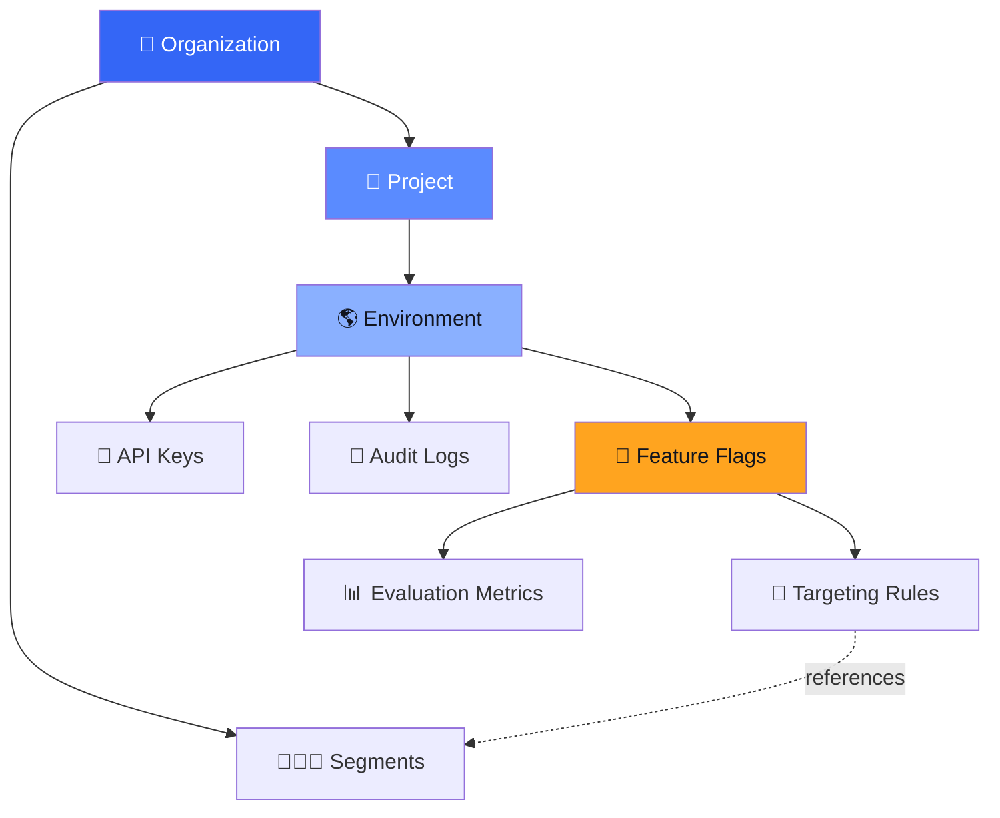

**Request flow for a typical dashboard action:**

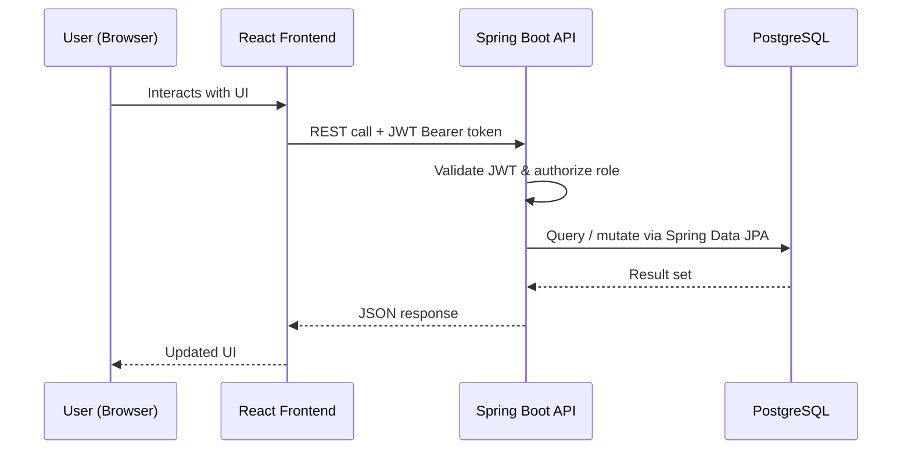

---

## 🧰 Tech Stack

### Backend

| Technology | Purpose |
|---|---|
| **Java 21** | Core language |
| **Spring Boot** | Application framework |
| **Spring Security** | Authentication & authorization |
| **Spring Data JPA / Hibernate** | ORM & persistence |
| **PostgreSQL** | Primary relational database |
| **Flyway** | Version-controlled schema migrations |
| **JWT (JSON Web Tokens)** | Stateless user authentication |
| **Maven** | Build & dependency management |
| **JUnit 5** | Unit testing |
| **Testcontainers** | Integration testing against real Postgres |

### Frontend

| Technology | Purpose |
|---|---|
| **React** | UI library |
| **TypeScript** | Static typing across the frontend |
| **Vite** | Build tool & dev server |
| **Tailwind CSS** | Utility-first styling, incl. dark mode |
| **React Router** | Client-side routing |
| **Axios** | HTTP client |

### DevOps

| Technology | Purpose |
|---|---|
| **Docker** | Containerization |
| **Docker Compose** | Local multi-service orchestration |
| **GitHub Actions** | Continuous integration |

---

## 📂 Project Folder Structure

```
feature-flag-engine/
├── backend/
│   ├── src/main/java/com/prateek/featureflag/
│   │   ├── auth/            # Registration, login, JWT issuing
│   │   ├── user/            # User entity & repository
│   │   ├── organization/    # Organization CRUD + membership
│   │   ├── project/         # Project CRUD
│   │   ├── environment/     # Environment CRUD (DEV/TEST/STAGING/PROD)
│   │   ├── flag/            # Feature flag CRUD + versioning
│   │   ├── rules/           # Targeting rule engine
│   │   ├── segment/         # User segments & membership
│   │   ├── apikey/          # Environment-scoped API key management
│   │   ├── evaluation/      # Flag evaluation endpoints (dashboard + SDK)
│   │   ├── metrics/         # Evaluation metrics aggregation
│   │   ├── audit/           # Audit log recording & retrieval
│   │   ├── security/        # Spring Security config, filters
│   │   └── common/          # Shared exception handling & utilities
│   └── src/main/resources/
│       ├── application.properties
│       └── db/migration/    # Flyway versioned SQL migrations
│
├── frontend/
│   └── src/
│       ├── api/              # Axios API clients per resource
│       ├── components/
│       │   ├── layout/       # Sidebar, Navbar, DashboardLayout
│       │   └── ui/           # Reusable UI primitives (Button, Card, Input…)
│       ├── context/          # Auth & Theme React contexts
│       ├── hooks/            # Custom hooks (useAuth, etc.)
│       ├── pages/            # Route-level pages, grouped by domain
│       ├── routes/           # Route definitions & guards
│       └── types/            # Shared TypeScript types
│
├── docker-compose.yml
├── .github/workflows/        # CI pipeline definitions
└── README.md
```

---

## 🗄️ Database Overview

Schema is fully managed via **Flyway** migrations. Core tables:

| Table | Description |
|---|---|
| `organizations` | Top-level tenant boundary |
| `users` | Registered user accounts |
| `members` | Organization ↔ user membership & role assignment |
| `projects` | Groups of environments within an organization |
| `environments` | `DEV` / `TEST` / `STAGING` / `PROD` scopes within a project |
| `feature_flags` | Flags defined per environment |
| `feature_rules` | Targeting rules attached to a flag |
| `segments` | Named user segments within an organization |
| `segment_users` | Segment membership by user identifier |
| `environment_api_keys` | Hashed API keys scoped to a single environment |
| `flag_versions` | Historical snapshots of flag state for audit/rollback |
| `audit_logs` | Immutable record of every mutating action |
| `flag_evaluation_metrics` | Pre-aggregated evaluation counters |

> All tables use UUID primary keys, and tenant isolation is enforced at the query layer via the organization → project → environment hierarchy.

---

## 🔐 Authentication Flow

Two distinct authentication paths exist, depending on the caller:

1. **Dashboard users (JWT)**
   - `POST /api/auth/register` → creates a user account
   - `POST /api/auth/login` → validates credentials, issues a signed JWT
   - Subsequent requests carry `Authorization: Bearer <token>`
   - Spring Security resolves the token into an authenticated principal and enforces organization-membership/role checks per endpoint

2. **SDK / API clients (Environment API Keys)**
   - Each environment can issue one or more API keys
   - Keys are hashed at rest and sent via a dedicated header on SDK evaluation requests
   - The security layer resolves the key into an `Environment`-scoped principal, authorizing access to only that environment's flags

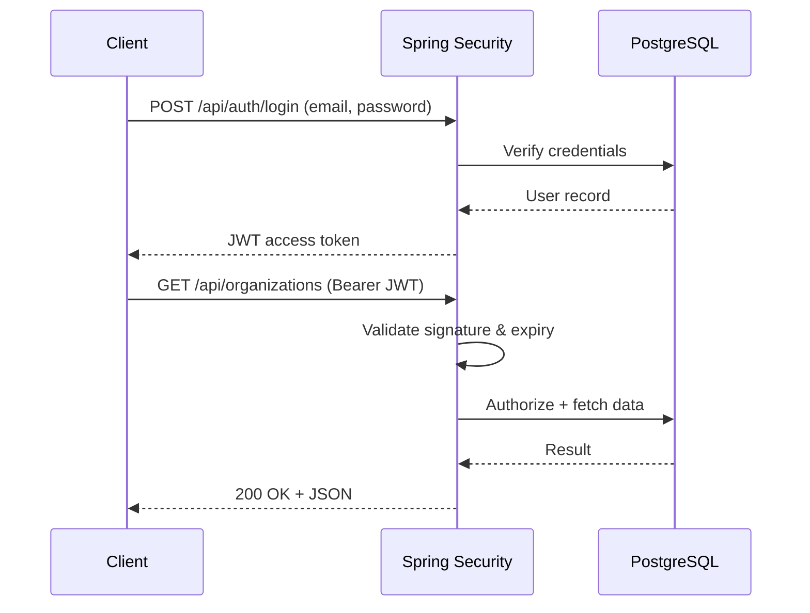

---

## ⚙️ Installation

### Prerequisites

- Java 21+
- Node.js 18+
- Maven 3.9+
- PostgreSQL 15+
- Docker & Docker Compose *(optional, for containerized setup)*

### Clone the repository

```bash
git clone https://github.com/<your-username>/feature-flag-engine.git
cd feature-flag-engine
```

---

## 🖥️ Running Locally

### 1. Configure the database

Create a local PostgreSQL database and update `backend/src/main/resources/application.properties` with your connection details, or export environment variables matching your config.

### 2. Run the backend

```bash
cd backend
./mvnw clean install
./mvnw spring-boot:run
```

Flyway will automatically apply all pending migrations on startup. The API will be available at `http://localhost:8080`.

### 3. Run the frontend

```bash
cd frontend
npm install
npm run dev
```

The app will be available at `http://localhost:5173`.

---

## 🐳 Docker Setup

Spin up the entire stack — backend, frontend, and PostgreSQL — with a single command:

```bash
docker compose up --build
```

This will:
- Build and start the PostgreSQL database
- Build and start the Spring Boot backend (migrations run automatically)
- Build and start the React frontend

> Adjust ports and environment variables in `docker-compose.yml` to match your local setup.

---

## 🔄 GitHub Actions CI

Every push and pull request triggers an automated pipeline that:

- ✅ Builds the backend with Maven
- ✅ Runs unit tests (JUnit 5)
- ✅ Runs integration tests (Testcontainers + PostgreSQL)
- ✅ Installs frontend dependencies and runs the build
- ✅ Reports build status on the PR

Workflow definitions live under `.github/workflows/`.

---

## 🔌 API Overview

A representative sample of the available REST endpoints:

| Method | Endpoint | Description |
|---|---|---|
| `POST` | `/api/auth/register` | Register a new user |
| `POST` | `/api/auth/login` | Authenticate and receive a JWT |
| `POST` | `/api/organizations` | Create an organization |
| `GET` | `/api/organizations` | List organizations for the current user |
| `POST` | `/api/organizations/{organizationId}/projects` | Create a project |
| `POST` | `/api/projects/{projectId}/environments` | Create an environment |
| `POST` | `/api/environments/{environmentId}/flags` | Create a feature flag |
| `PUT` | `/api/flags/{flagId}` | Update a feature flag |
| `POST` | `/api/flags/{flagId}/enable` / `/disable` | Toggle a flag's state |
| `POST` | `/api/flags/{flagId}/rules` | Add a targeting rule to a flag |
| `POST` | `/api/organizations/{organizationId}/segments` | Create a user segment |
| `POST` | `/api/segments/{segmentId}/members` | Add a member to a segment |
| `POST` | `/api/environments/{environmentId}/api-keys` | Issue a new environment API key |
| `POST` | `/api/environments/{environmentId}/evaluate` | Evaluate flags for the dashboard |
| `POST` | `/api/sdk/evaluate` | Evaluate flags via SDK using an API key |
| `GET` | `/api/flags/{flagId}/versions` | View a flag's version history |
| `POST` | `/api/flags/{flagId}/versions/{version}/rollback` | Roll back to a previous version |
| `GET` | `/api/organizations/{organizationId}/audit-logs` | Retrieve audit log entries |
| `GET` | `/api/flags/{flagId}/metrics` | View evaluation metrics for a flag |

---

## 📸 Screenshots

### Register

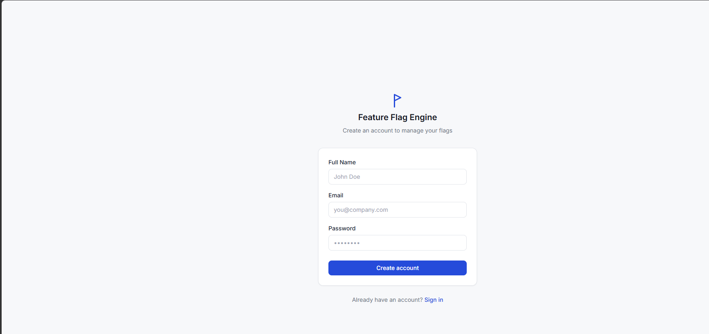

---

### Login

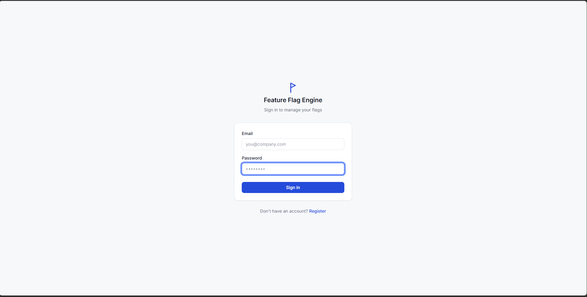

---

### Dashboard

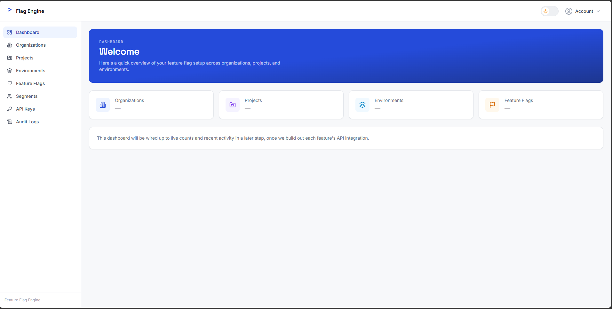

---

### Dark Mode

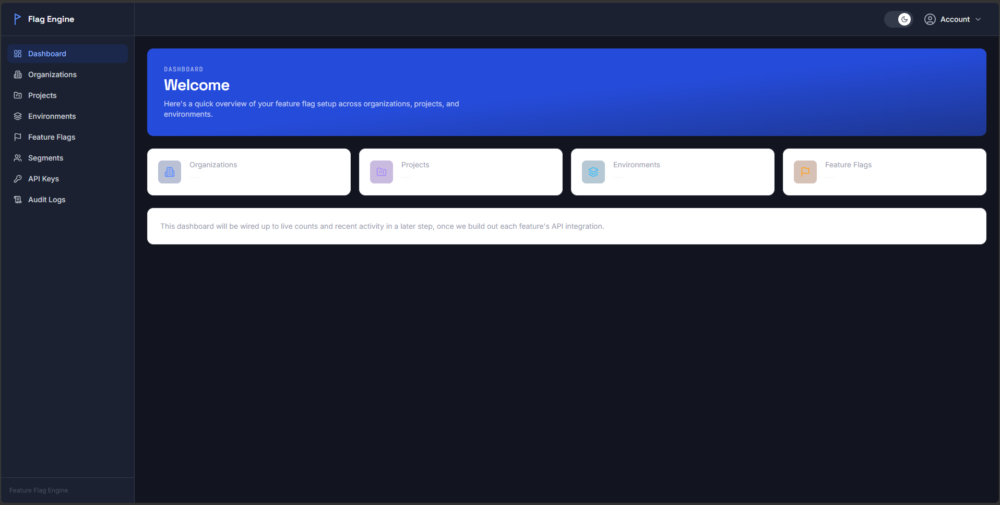

---

### Organizations

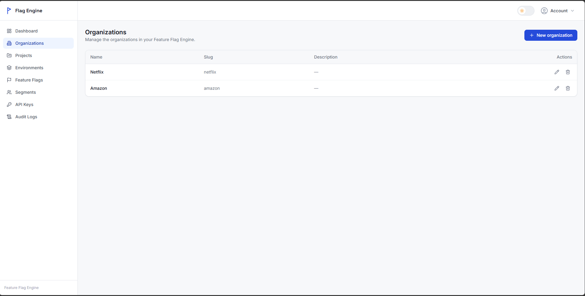

---

### Create Organization

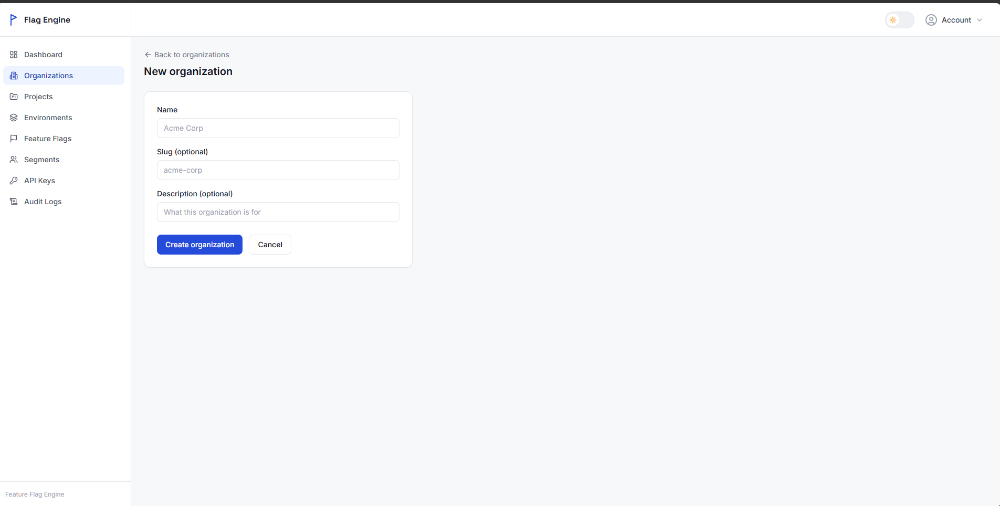

---

### Projects

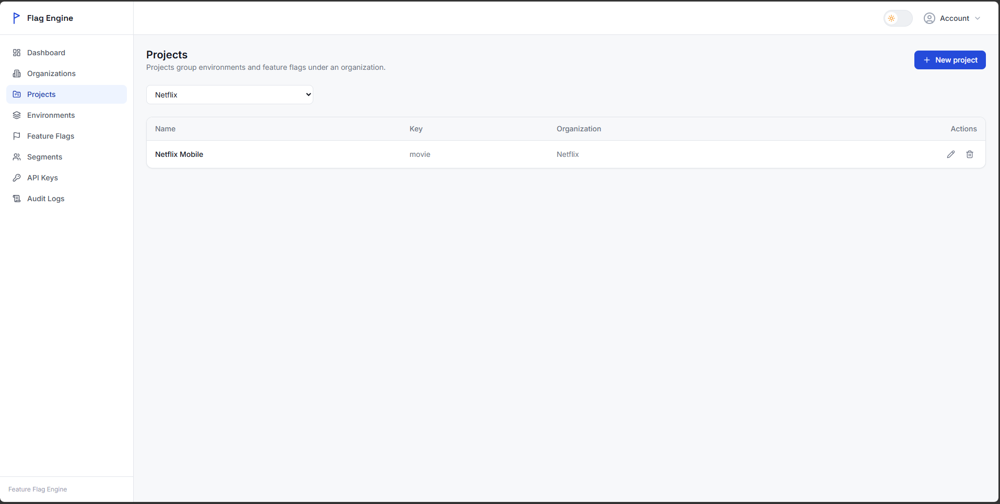

---

### Environments

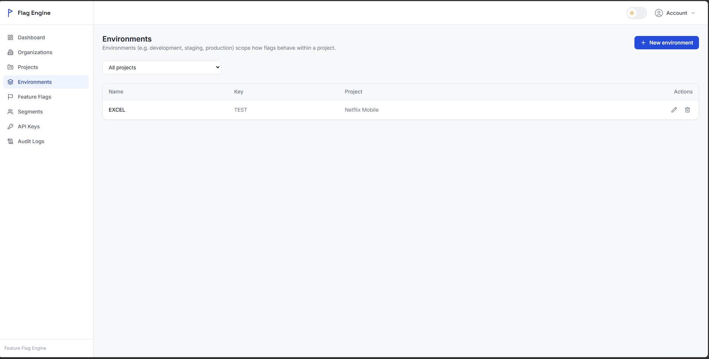

---

### Feature Flags


---

### Segments


---

### API Keys

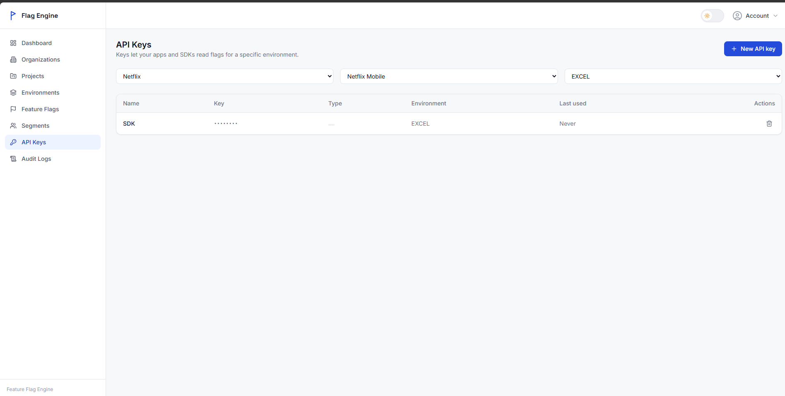

---

### Audit Logs


---

### Docker Running

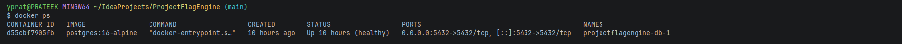

---

## 🛣️ Future Improvements

- [ ] Audit logging for SDK-originated evaluation requests
- [ ] Real-time flag updates via WebSockets/SSE (no polling)
- [ ] Percentage-based rollouts & multivariate flags
- [ ] Webhook notifications on flag state changes
- [ ] Rate limiting on public SDK evaluation endpoints
- [ ] SSO / OAuth2 login support
- [ ] Organization-level usage analytics dashboard
- [ ] Kubernetes deployment manifests / Helm chart

---

## 📄 License

This project is licensed under the **MIT License** — see the [LICENSE](./LICENSE) file for details.

---

## 👤 Author

**Prateek**

Built as a hands-on deep dive into production-grade backend architecture — multi-tenancy, authorization boundaries, auditability, and clean API design — paired with a modern React/TypeScript frontend.

---

## 🤝 Contributing

This is primarily a personal portfolio project, but suggestions and issue reports are welcome!

1. Fork the repository
2. Create a feature branch (`git checkout -b feature/your-feature`)
3. Commit your changes (`git commit -m 'Add some feature'`)
4. Push to the branch (`git push origin feature/your-feature`)
5. Open a Pull Request

---

<div align="center">

⭐ **If you found this project interesting, consider giving it a star!** ⭐

</div>
